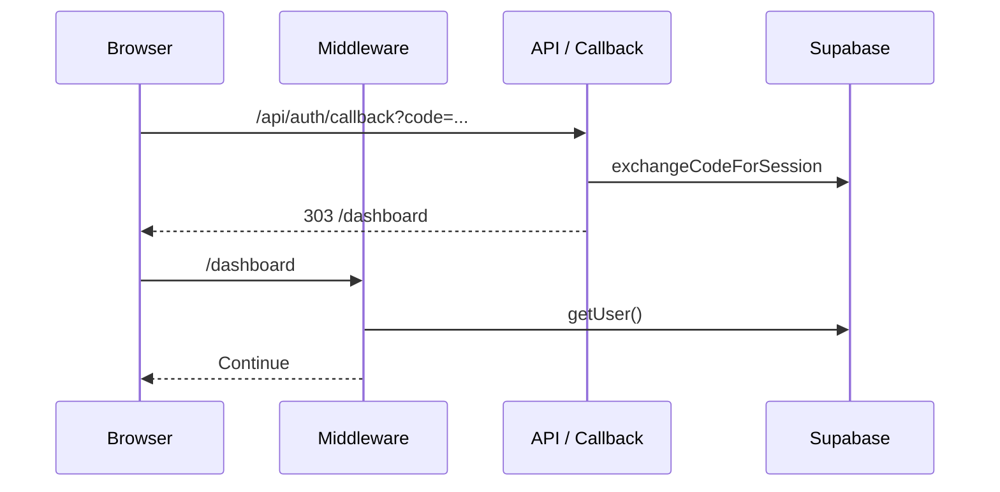

## Auth Flow

### Paths and modules
- UI: `src/app/login/page.tsx`
- OAuth callback: `src/app/api/auth/callback/route.ts`
- SSR client: `src/lib/supabaseServer.ts`
- Client: `src/lib/supabaseClient.ts`
- Middleware: `src/middleware.ts`

### Email/password
1. User submits credentials on `/login` using browser client.
2. Supabase sets session; `@supabase/ssr` keeps cookies in sync for SSR.
3. On success, navigate to `redirect` (default `/dashboard`).

### OAuth
1. Client calls `signInWithOAuth` with `redirectTo=/api/auth/callback?redirect=...`.
2. On return, `GET /api/auth/callback` calls `exchangeCodeForSession(code)` using the SSR server client.
3. Redirect to `redirect` (default `/dashboard`).

### Middleware responsibilities
- For protected routes (`/dashboard`, `/lesson/*`, `/perks`, `/favorites`, all `/admin/*`):
  - Ensure user is authenticated; else 302 to `/login?redirect=...`.
  - If not admin and not on pay paths, check `profiles.has_access`; if false, 302 `/pay`.
  - For `/admin/*`, require `profiles.role='admin'`.

