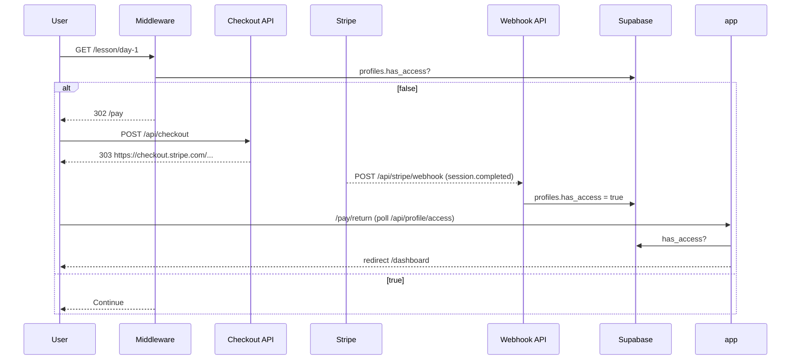

## Paywall Flow

### Overview
Unpaid users are redirected to `/pay` by Edge middleware for most protected paths. Purchase flips `profiles.has_access` via Stripe webhook, after which the user is allowed through.

### Sequence

### Key files
- `src/middleware.ts`
- `src/app/api/checkout/route.ts`
- `src/app/api/stripe/webhook/route.ts`
- `src/app/pay/return/page.tsx`

