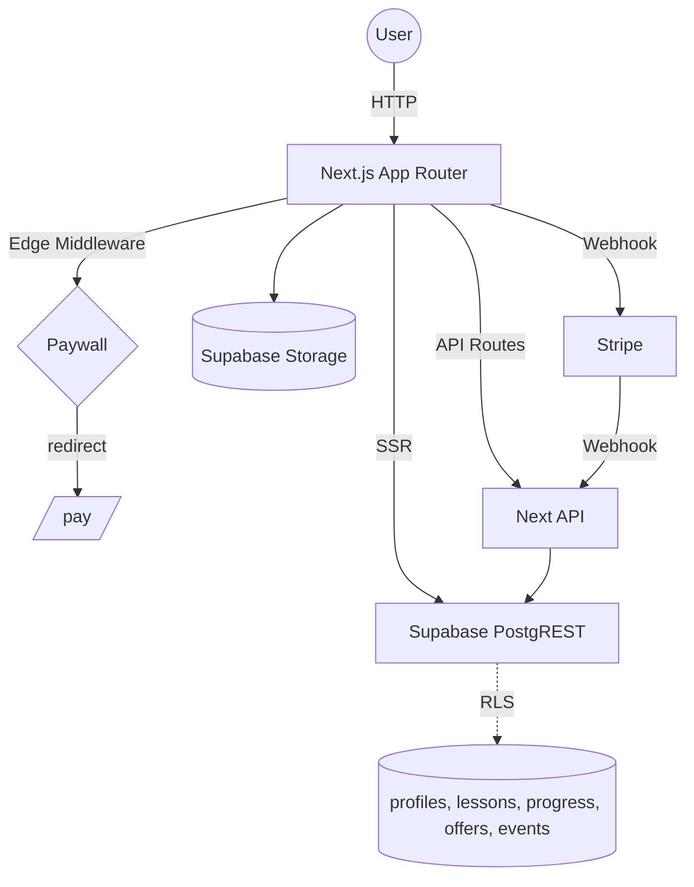

## SEO Playbook — System Overview

This repository implements the 30‑Day Local SEO Playbook as a modern, gated learning experience.

- **Stack**: Next.js App Router (SSR + RSC), React 19, Tailwind v4, Supabase (Auth, PostgREST, RLS, Storage), Stripe Checkout/Webhooks.
- **Auth**: Supabase email/password + optional OAuth; SSR cookies via `@supabase/ssr` (`src/lib/supabaseServer.ts`, `src/lib/supabaseClient.ts`).
- **Paywall**: Enforced in `src/middleware.ts` by checking `profiles.has_access` and redirecting unpaid users to `/pay`.
- **Lessons**: Stored in `public.lessons` as rich JSON blocks with denormalized `body_text`/`tags_text` for search.
- **Progress**: Per‑user per‑lesson rows in `public.progress` plus a `user_completion` view for overall percent.
- **Offers/Perks**: Unlockable by day and/or percent via `public.offers` and a `perk_unlocks` view; redemption recorded in `public.events`.
- **Admin**: CRUD for lessons/offers via Next.js API routes with RLS guardrails and server‑side admin checks.

### Quick links
- Architecture: [stack-and-architecture.md](./stack-and-architecture.md)
- Data model: [data-model/schema.md](./data-model/schema.md), [RLS](./data-model/rls-policies.md), [Events](./data-model/events.md)
- API surface: [api/index.md](./api/index.md)
- Flows: [Auth](./app-flows/auth-flow.md), [Paywall](./app-flows/paywall-flow.md), [Lesson](./app-flows/lesson-consumption.md), [Progress](./app-flows/progress-tracking.md), [Perks](./app-flows/offers-perks.md), [Favorites](./app-flows/favorites-flow.md)
- UI: [components.md](./ui/components.md)
- Setup/Ops: [Local setup](./setup-and-ops/local-setup.md), [Env vars](./setup-and-ops/env-vars.md), [Seeding](./setup-and-ops/seeding-and-parsing.md)
- Decisions (ADRs): [SSRs + cookies](./decisions/adr-0001-supabase-ssr-cookies.md), [Paywall in middleware](./decisions/adr-0002-paywall-in-middleware.md), [RLS + service role](./decisions/adr-0003-rls-and-service-role-usage.md)

### High-level architecture

### Core behaviors by feature
- **Auth**: Client logs in on `/login`. OAuth callback lands on `/api/auth/callback` where `exchangeCodeForSession` writes cookies used by SSR and middleware.
- **Paywall**: Middleware checks `profiles.has_access` and redirects unpaid users to `/pay`. Stripe Checkout (`POST /api/checkout`) + webhook (`POST /api/stripe/webhook`) flips access.
- **Lessons**: `/lesson/[slug]` loads lesson JSON blocks and logs a `lesson_viewed` event. Previous/next and sidebar are computed server‑side.
- **Progress**: “Mark Complete” submits to `POST /api/progress/complete` to upsert progress and optionally 303 to the next lesson.
- **Offers/Perks**: `/perks` shows available offers. Unlocks computed in SQL view `perk_unlocks`. Redemption via `POST /api/perks/redeem`.
- **Favorites**: Client toggles call `POST /api/favorites`. Server lists favorites with joins for display.
- **Admin**: CRUD via `/api/admin/*` endpoints, guarded by admin role and RLS.

For deep dives and exact request/response examples, continue to [api/index.md](./api/index.md) and the flow docs in `docs/app-flows/`.

