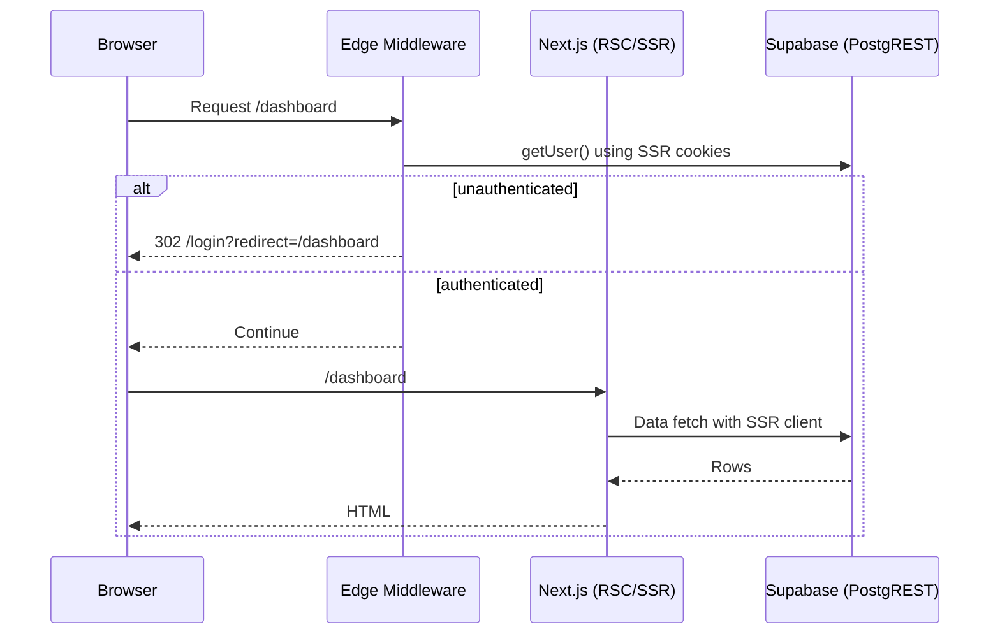
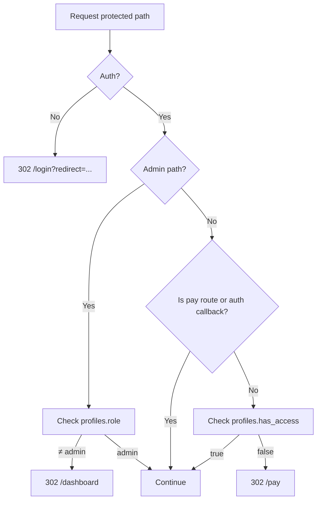

## Stack and Architecture

### Stack
- **Framework**: Next.js App Router (RSC + SSR)
- **UI**: React 19, Tailwind v4, custom components (`Card`, `Button`, `ProgressRing`, `Pill`, `WeekAccordion`, etc.)
- **Auth/DB**: Supabase (Auth, PostgREST, Storage), RLS policies in `supabase/schema.sql`
- **Payments**: Stripe Checkout and Webhooks

### Key modules
- `src/lib/supabaseClient.ts`: Browser client (`createBrowserClient`) for client auth flows; syncs session cookies for SSR.
- `src/lib/supabaseServer.ts`: SSR server client using `cookies()` to maintain session across RSC/API.
- `src/middleware.ts`: Edge middleware for route gating (auth + paywall + admin role check).
- Pages: `src/app/dashboard/page.tsx`, `src/app/lesson/[slug]/page.tsx`, etc.
- API routes: under `src/app/api/**/route.ts`.

### Request lifecycle (SSR auth)

### Paywall decision points

### Data access patterns
- Use the SSR client in server components and API routes to respect the user’s session and RLS.
- Favor SQL views for derived data (e.g., `user_completion`, `perk_unlocks`) and keep UI logic thin.
- For service operations (Stripe webhook, Storage uploads), use the Service Role key server‑side only.

### Source-of-truth locations
- Auth + Sessions: Supabase Auth and cookies handled via `@supabase/ssr`.
- Paywall: `src/middleware.ts`.
- DB schema, triggers, RLS: `supabase/schema.sql`.
- Payment integration: `src/app/api/checkout/route.ts`, `src/app/api/stripe/webhook/route.ts`.
- Event logging: `public.events` from pages and API routes.

